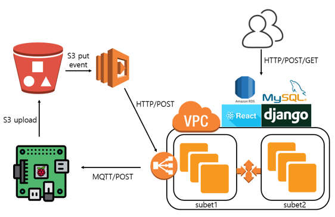

# autoRecycle 
2019-2 latest technical project2

### Member
- 김원규, 김효준, 백종현, 정의동

### Intro

- 분리수거의 알맞지 않은 수행 
=> 재처리 시에 많은 비용이 발생한다. 
=> 분리수거에 관심이 없다면 많이 신경쓰지 않는다.

`쓰레기에 알맞은 쓰레기통을 열자!`

### Architecture

- 하드웨어 

- 소프트웨어

### Further More
- 보고서 폴더 참고바람.
